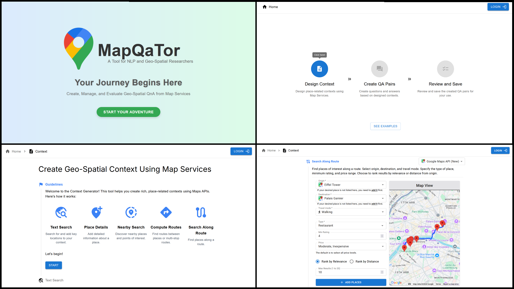

# MapQaTor: A System for Efficient Annotation of Map Query Datasets


<p align="center">
    <a href="https://arxiv.org/abs/2412.21015">📃 Paper</a> •
    <a href="https://github.com/orgs/mapqator/repositories">💻 Code</a> •
    <a href="https://youtu.be/7_aV9Wmhs6Q">🎬 Demo</a> •
    <a href="https://mapqator.github.io/">🌐 Website</a> •
    <a href="https://mapqator.github.io/paper">🏠 Homepage</a>
</p>

## 📢 Updates

- 2024-12-30: We have released our [paper](https://arxiv.org/abs/2412.21015) and [website](https://mapqator.github.io/). Check it out!
- 2024-10-17: Major updates for NAACL 2025 Demo Track submission. This version is live [here](https://mapqator.github.io/).
- 2024-07-30: Major updates for EMNLP 2024 Demo Track submission. This version is live [here](https://mahirlabibdihan.github.io/mapquest).
- 2024-04-29: The first version of the website for annotating the [MapEval](https://mapeval.github.io/) benchmark is deployed. This version is live [here](https://mahirlabibdihan.github.io/mapquest/old-home).
<!-- ## 📢 Updates
- 2024-12-29: We have released our [paper](https://arxiv.org/abs/2404.07972) and [website](https://mapqator.github.io/). Check it out!
- 2024-12-16: Paper submitted to NAACL 2025 Demo Track.
- 2024-08-06: Paper submitted to EMNLP 2024 Demo Track (Rating: 5,6,7). 
- 2024-04-29: First website is created which used for annotation in [MapEval](https://mapeval.github.io/). This version is live [here](https://mahirlabibdihan.github.io/mapquest/old-home). -->

## 📖 Abstract
Mapping and navigation services like Google Maps, Apple Maps, Openstreet Maps, are essential for accessing various location-based data, yet they often struggle to handle natural language geospatial queries. Recent advancements in Large Language Models (LLMs) show promise in question answering (QA), but creating reliable geospatial QA datasets from map services remains challenging. We introduce MapQaTor, a web application that streamlines the creation of reproducible, traceable map-based QA datasets. With its plug-and-play architecture, MapQaTor enables seamless integration with any maps API, allowing users to gather and visualize data from diverse sources with minimal setup. By caching API responses, the platform ensures consistent ground truth, enhancing the reliability of the data even as real-world information evolves. MapQaTor centralizes data retrieval, annotation, and visualization within a single platform, offering a unique opportunity to evaluate the current state of LLM-based geospatial reasoning while advancing their capabilities for improved geospatial understanding. Evaluation metrics show that, MapQaTor speeds up the annotation process by at least 30 times compared to manual methods, underscoring its potential for developing geospatial resources, such as complex map reasoning datasets.

## 🌎 MapQaTor Overview


We present **MapQaTor**, a web application designed to streamline the creation of map-based QA datasets. MapQaTor empowers researchers to seamlessly integrate with any map API in a plug-and-play manner, enabling them to gather, visualize, and annotate geospatial data with minimal setup. By caching API responses, the platform ensures a consistent ground truth, which enhances the reliability of the datasets, even as real-world information evolves over time.
In summary, we have made the following key contributions:

- We propose a novel framework, MapQaTor, first of its kind, which simplifies the creation of reproducible map-based QA datasets and reduces reliance on manual data collection through seamless integration with any map API (e.g., Google Maps, Apple Maps, Openstreet maps, etc.) in a plug-and-play manner.
- We provide visualization tools that facilitate better understanding and annotation of geospatial information.
- We implement caching of API responses to ensure a consistent ground truth, enhancing the reliability of QA tasks over time.
- We evaluate MapQaTor to estimate its usefulness and efficiency. 

## 📸 Snapshots



## 🛠️ Implementation Details

- **Frontend**: The frontend is built using Next.js, Tailwind CSS and Material-UI. The codebase is available [here](https://github.com/mapqator/mapqator.github.io).
- **Backend**: The backend is built using Node JS and Express JS. The codebase is available [here](https://github.com/mapqator/mapqator-backend).
- **Database**: PostgreSQL is used as the database system. The database schema is available [here](https://github.com/mapqator/mapqator-backend/blob/master/database/schema.sql).

## 📝 Citation
If you use our website for annotation, please cite our paper:
```
@article{dihan2024mapqator,
  title={MapQaTor: A System for Efficient Annotation of Map Query Datasets},
  author={Dihan, Mahir Labib and Ali, Mohammed Eunus and Parvez, Md Rizwan},
  journal={arXiv preprint arXiv:2412.21015},
  year={2024}
}
```