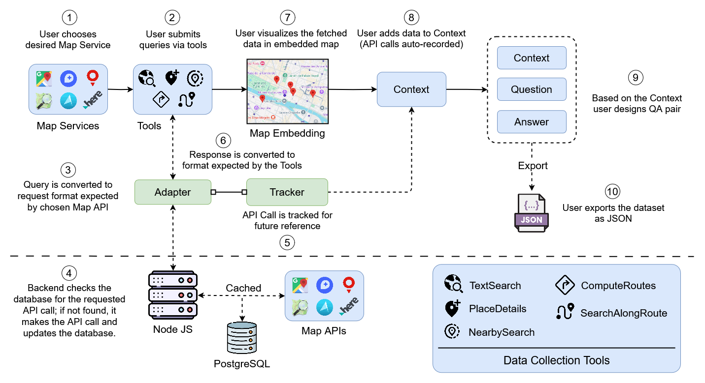

# MapQaTor: A System for Efficient Annotation of Map Query Datasets

    <a href="https://mapqator.github.io/">Website</a> •
    <a href="https://arxiv.org/abs/2404.07972">Paper</a> •
    <a href="https://youtu.be/7_aV9Wmhs6Q">Demo</a>

## 📢 Updates
- 2024-12-16: Paper submitted to NAACL 2025 Demo Track.
- 2024-08-06: Paper submitted to EMNLP 2024 Demo Track (Rating: 5,6,7).

## 📖 Abstract
Mapping and navigation services like Google Maps, Apple Maps, Openstreet Maps, are essential for accessing various location-based data, yet they often struggle to handle natural language geospatial queries. Recent advancements in Large Language Models (LLMs) show promise in question answering (QA), but creating reliable geospatial QA datasets from map services remains challenging. We introduce MapQaTor, a web application that streamlines the creation of reproducible, traceable map-based QA datasets. With its plug-and-play architecture, MapQaTor enables seamless integration with any maps API, allowing users to gather and visualize data from diverse sources with minimal setup. By caching API responses, the platform ensures consistent ground truth, enhancing the reliability of the data even as real-world information evolves. MapQaTor centralizes data retrieval, annotation, and visualization within a single platform, offering a unique opportunity to evaluate the current state of LLM-based geospatial reasoning while advancing their capabilities for improved geospatial understanding. Evaluation metrics show that, MapQaTor speeds up the annotation process by at least 30 times compared to manual methods, underscoring its potential for developing geospatial resources, such as complex map reasoning datasets. The website is live at: https://mapqator.github.io/ and a demo video is available at: https://youtu.be/7_aV9Wmhs6Q.
